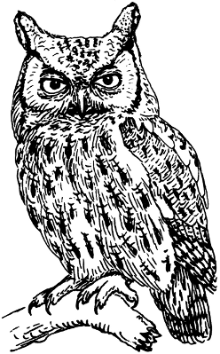

# Owldoc

_A JavaScript prose documentation generator._

Owldoc is a tool for generating prose documentation using Node.js, in the style of
Sphinx. It accepts a Markdown file and an EJS template file, and proceeds to
generate a documentation file with them.

Owldoc is freely distributable under the terms of the MIT license.

## Basic Usage

    $ owldoc docs.md > docs.html

And hey presto, your documentation is now generated!

## Rendering

The template is supplied with the following context variables:

 * `title`

   The text of the first heading.

 * `content`

   Contains the rendered Markdown.

 * `toc`

   Contains a table of contents tree. It has three attributes: `id` which
   contains the anchor to a section, `children` which contain all items
   underneath this level, and `title` for the text of the section. If `id` is
   `null`, then this section doesn't actually exist, and the item is there just
   to act as a placeholder.

During rendering, all headings are given `id` attributes for anchors. These
anchors are resolved in order — for instance, the anchor to this section is
[`#Rendering`](#Rendering). If another section was named "Rendering" after this
section, then the anchor to that section will be named `#Rendering-2`.

If you want to override the anchor text, simply surround the section of the
title you want to make the anchor with ``.

